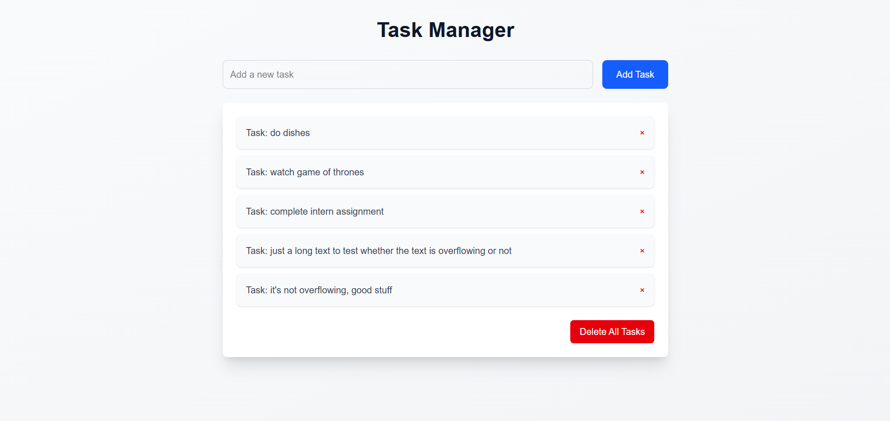

# Task Manager - MERN Stack Application



Task Manager is a simple and intuitive task management application built using the MERN stack (MongoDB, Express.js, React, and Node.js). It allows users to add, view, and delete tasks with a clean and modern user interface. The frontend is built with **Vite** for fast development, styled using **Tailwind CSS**, and enhanced with **React Hot Toast** for notifications.

---

## Features

- **Add Tasks**: Easily add new tasks with a simple input form.
- **View Tasks**: See all your tasks in a clean and organized list.
- **Delete Tasks**: Remove individual tasks or delete all tasks at once.
- **Notifications**: Get instant feedback with toast notifications using React Hot Toast.
- **Responsive Design**: Fully responsive and mobile-friendly UI powered by Tailwind CSS.
- **Confirmation Modal**: A modal ensures you don’t accidentally delete all tasks.

---

## Technologies Used

- **Frontend**:
  - React (Vite)
  - Tailwind CSS
  - React Hot Toast (for notifications)
- **Backend**:
  - Node.js
  - Express.js
- **Database**:
  - MongoDB
- **Other Tools**:
  - Axios (for API calls)
  - React Modal (for confirmation dialogs)

---

## Installation and Setup

Follow these steps to set up the project locally on your machine.

### Prerequisites

- Node.js (v16 or higher)
- MongoDB (local or cloud instance)
- Git

### Steps

1. **Clone the Repository**:
   ```bash
   git clone https://github.com/coderkaushik/cognocore.git
   cd cognocore
   ```

2. **Install Dependencies**:

   Navigate to the client folder and install frontend dependencies:
   ```bash
   cd client
   npm install
   ```

   Navigate to the server folder and install backend dependencies:
   ```bash
   cd ../server
   npm install
   ```

3. **Set Up Environment Variables**:

   Create a `.env` file in the server folder and add your MongoDB connection string:
   ```env
   MONGODB_URI=your_mongodb_connection_string
   PORT=5000
   ```

4. **Run the Application**:

   Start the backend server:
   ```bash
   cd server
   npm start
   ```

   Start the frontend development server:
   ```bash
   cd ../client
   npm run dev
   ```

5. **Access the Application**:

   Open your browser and navigate to `http://localhost:5173` (or the port specified by Vite).

---

## Folder Structure

```plaintext
task-manager-mern/
├── client/                  # Frontend (React + Vite)
│   ├── public/              # Static assets
│   ├── src/                 # React components and logic
│   │   ├── components/      # Reusable components
│   │   ├── App.jsx          # Main application component
│   │   └── main.jsx         # Entry point
│   └── package.json         # Frontend dependencies
├── server/                  # Backend (Node.js + Express)
│   ├── models/              # MongoDB models
│   ├── .env                 # Environment variables
|   |── index.js             # Main server component with routes and express server
│   └── package.json         # Backend dependencies
└── README.md                # Project documentation
```

---

## Usage

### Add a Task:

Enter a task in the input field and click "Add Task."

A toast notification will confirm the task has been added.

### Delete a Task:

Click the "Delete" button next to a task to remove it.

A toast notification will confirm the task has been deleted.

### Delete All Tasks:

Click the "Delete All Tasks" button to remove all tasks.

A confirmation modal will appear to prevent accidental deletions.

---

## Acknowledgments

- Vite for the fast development environment.
- Tailwind CSS for the utility-first CSS framework.
- React Hot Toast for toast notifications.
- MongoDB for the database.

---

## Contact

For any questions or feedback, feel free to reach out:

Hiteshwar Kaushik

Email: thehiteshwarkaushik@gmail.com

GitHub: CoderKaushik